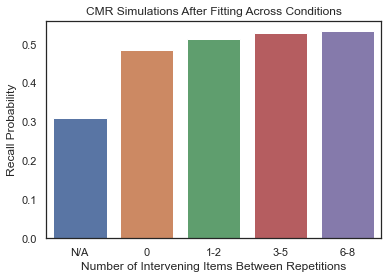
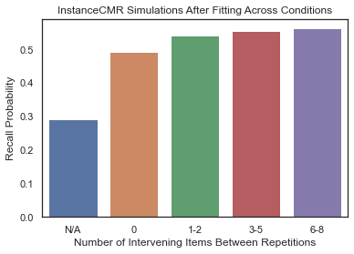
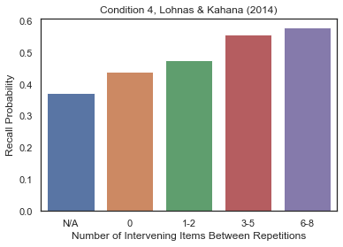

## Repetition Effects
While previous analyses evince that our prototype-based and instance-based implementations of CMR equivalently account for free recall performance when each unique item is presented just once during study, there is reason to suspect that the models might diverge when it comes to accounting for the effect of item repetition on later free recall.

Previous work [@siegel2014retrieved] has related CMR to two broad accounts of how item repetition influences memory and in particular drives the spacing effect, a monotonic relationship between recall probability and the size of the lag between item repetitions in a study list. Under the contextual-variability account [@anderson1972recognition], each time an item is studied, it's associated in memory with the current state of a slowly drifting contextual representation. Depending on how spaced apart two presentations of an item might be, the contextual states they are associated with might either be very similar or very distinct. Later, participants use the current state of their contextual representation to probe their memories and retrieve items during free recall. When an item has been associated with diverse contextual states, it can correspondingly be retrieved using diverse possible cues. In this way, the improvements in recall we gain from spacing presentations of an item are explained in terms of variation in the range of possible cues that can trigger recall of that item. A study-phase retrieval account of the spacing effect alternatively emphasizes the consequences of studying a successively presented item. According to the account, when this happens we retrieve memories of the repeated item's earlier occurrences and their associated contexts. When this happens, it's proposed that retrieved information is memorally associated with information corresponding to the current presentation context.

Analyses of our instance-based implementation of CMR so far suggest it realizes these mechanisms similarly to the original prototype-based CMR. A potentially more relevant distinction between the models might instead turn on differences in how records of past experience are integrated for retrieval. InstanceCMR, like MINERVA 2, has the option to apply its nonlinear activation scaling parameter $\tau$ to activations of individual traces - that is, before integration into a unitary vector tracking retrieval support. However, CMR does not access trace activations and applies $\tau$ to the integrated echo representation result.

This distinction between instance-based and prototype-based architectures has been marshalled to explain model differences in other research contexts [e.g., @jamieson2018instance]. In this context, however, the different between applying $\tau$ to trace activations or echo content is between enforcing quasi-linear or quasi-exponential effect of item repetition on subsequent recall probability. Suppose a constant sensitivity parameter $\tau$ and that two distinct experiences each contributed a support of $c$ for a given feature unit in the current recall. Under trace-based sensitivity scaling, the retrieval support for that feature unit would be $c^{\tau} + c^{\tau}$. But under echo-based sensitivity scaling, support would be ${(c + c)}^{\tau}$, a much larger quantity.

Another way to illustrate this architectural difference is by simulation. We can have our prototype-based and each variant of our instance-based implementation of CMR simulate a traditional list-learning experiment with study of 20 unique items in order. Then, we can simulate repeated study of an arbitrary item in that list and measure the effect on the probability of retrieving that item for each successive repetition given a static retrieval cue. [Figure @fig-repeffect] plots the result of of this simulation over 1000 experiments for 50 item repetitions using PrototypeCMR and InstanceCMRand model parameters fitted using data from @murdock1970interresponse and corresponds with our predictions. Model fitting over a different dataset might obviate these observed differences; however these simulations raise the possibility that with increasing item repetitions, prototype-based and instance-based implementations of CMR might support different predictions about the influence of item repetition on later recall probability, motivating further investigation.

::: {#fig-repeffect layout-ncol=2 layout-valign="center"}

{#fig-cmr_repeffect}

{#fig-icmr_repeffect}

Course of effect of successive item repetitions on recall probability, by model, using parameters fitted over @murdock1970interresponse dataset and a static contextual cue after simulation of a pure 20-item list.
:::

Though initial simulations suggest a way to distinguish between instance- and prototype-based accounts of context maintenance and retrieval, free recall datasets with high amounts of repetition to the extent simulated in the above example do not yet exist. However, to support an initial comparison of how models account for item repetition effects, we use data associated with @siegel2014retrieved. Within the dataset, 35 subjects performed delayed free recall of 48 lists over four sessions. Except for deliberate item repetitions, words were unique within each session and did not repeat in successive sessions. The semantic relatedness of words was also controlled below a value of .55 according to WAS [@steyvers2005word]. Across trials, lists were structured in four different ways:

1. In control lists, all items were only presented once.

2. In pure massed lists, items were presented twice, always in succession (e.g. 1, 1, 2, 2)

3. In pure spaced lists, items were presented twice with spacing of repetitions from 1 to 8 positions, with each spacing amount equiprobable.

4. Finally, mixed lists feature once-presented, massed, and spaced items, with each spacing amount equiprobable

As with previous analyses, each model variant was fit once for each participant to identify the parameter configuration maximizing the likelihood of observed recall sequences given the considered model, considering all conditions of the dataset. The distribution of data log-likelihoods given each fitted model and participant are plotted in [Figure @fig-LohnasFits], with median values for each model variant highlighted. Similarly to previous analyses, these value distributions were found largely similar. The distribution of log-likelihood scores between participants for the PrototypeCMR and InstanceCMR model variants only marginally differ, suggesting that all considered model variants can predict recall sequences even when item repetitions occur during study with similar degrees of success.

::: {#fig-lohnasfits layout-ncol=2 layout-valign="center"}

|       |   InstanceCMR |   PrototypeCMR |
|:------|--------------:|---------------:|
| count |        35     |         35     |
| mean  |      1676.3   |       1668.35  |
| std   |       434.819 |        429.581 |
| min   |       914.375 |        856.293 |
| 25%   |      1367.75  |       1378.27  |
| 50%   |      1686.97  |       1698.98  |
| 75%   |      1955.37  |       1957.65  |
| max   |      2752.36  |       2751.88  |

Log-likelihood score distributions for each subject under each considered model [@siegel2014retrieved]
:::

While follow-up analysis of summary statistics in previous analyses focused on benchmark phenomena such as serial position effects, inclusion of item repetitions in study designs complicates associated visualizations. Instead, we focused comparison on summary statistics measuring classical item repetition effects. In [Figure @fig-lohnas_spacing], we measure how effectively our prototype- and instance-based CMR implementations account for the spacing effect. Main model variants were fit to the mixed list (fourth) condition of the entire dataset across subjects to optimize the likelihood of observed recall sequences. Then with each configured model, study phases of each trial in the mixed condition of the dataset were simulated and then followed with simulation of free recall. We then plot for both the behavioral data and simulated datasets, the rate at which items were recalled, binned based on the number of intervening items between repetitions. On the one hand, we observe that both models poorly account for the pattern of recall rates observed as a function of presentation spacing in the mixed condition of the @siegel2014retrieved dataset, exaggerating the mnemonic benefit of item repetition in general while understating the mnemonic effect of increased spacing between repetitions. On the other hand, recapitulating all previous analyses, we again found that both our prototype-based and main instance-based implementations of CMR predicted similar patterns of effects of repetition spacing on later item recall.

::: {#fig-lohnas_spacing layout-ncol=3}

{#fig-cmr_spacing}

{#fig-icmr_spacing}

{#fig-data_spacing}

Comparison of predicted recall probability as function of item repetition spacing between each model and the observed data [@siegel2014retrieved].
:::
